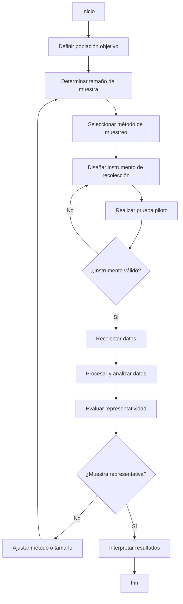

```mermaid
graph TD
    A[Inicio] --> B[Definir población objetivo]
    B --> C[Determinar tamaño de muestra]
    C --> D[Seleccionar método de muestreo]
    D --> E[Diseñar instrumento de recolección]
    E --> F[Realizar prueba piloto]
    F --> G{¿Instrumento válido?}
    G -->|No| E
    G -->|Sí| H[Recolectar datos]
    H --> I[Procesar y analizar datos]
    I --> J[Evaluar representatividad]
    J --> K{¿Muestra representativa?}
    K -->|No| L[Ajustar método o tamaño]
    L --> C
    K -->|Sí| M[Interpretar resultados]
    M --> N[Fin]
```
